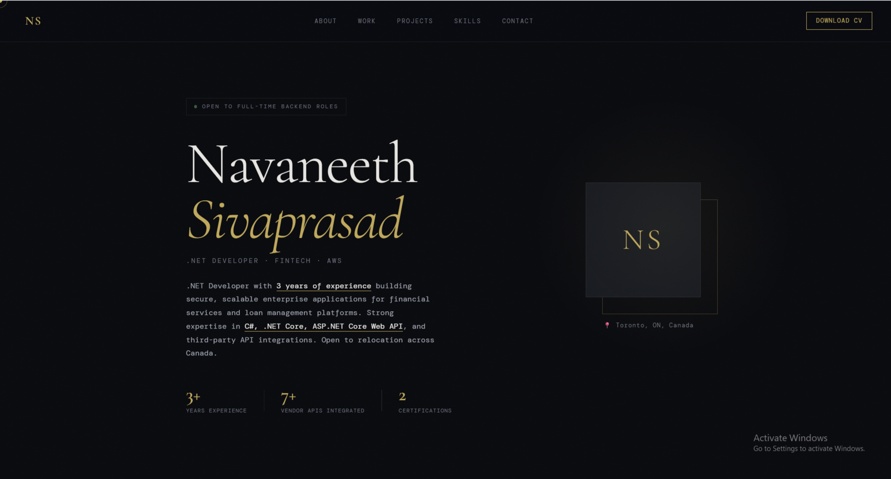
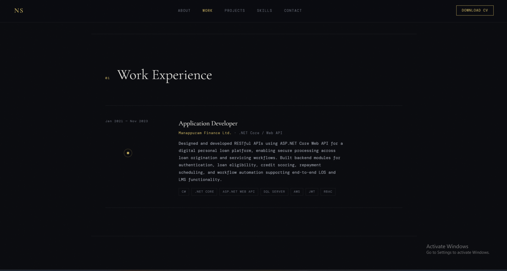
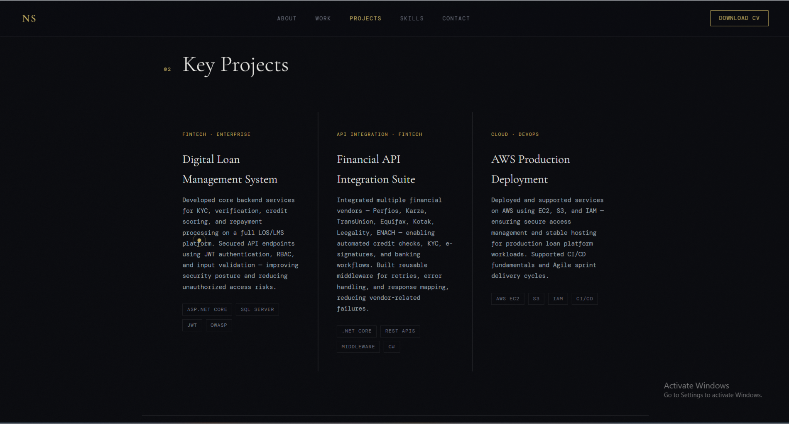
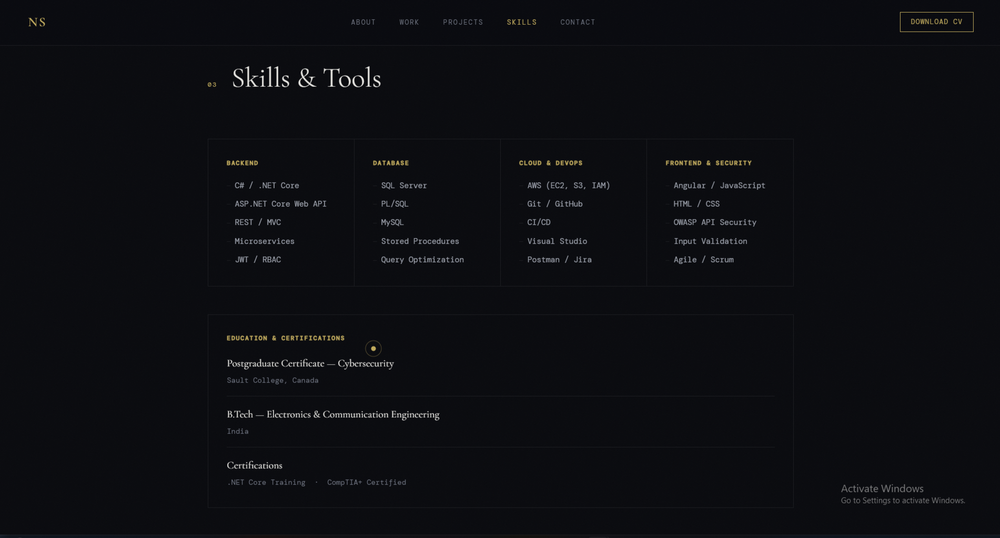
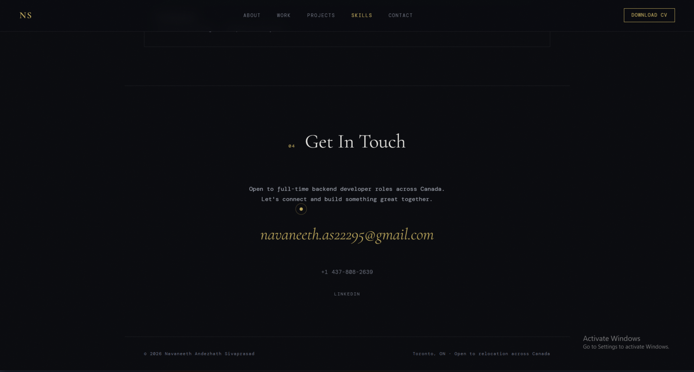

# Resume Website

A responsive personal portfolio and resume website built using HTML, CSS, and JavaScript.  
This project demonstrates a clean and modern developer portfolio design that can be easily deployed using GitHub Pages or any static hosting platform.

The website presents professional experience, projects, skills, and contact information in a visually appealing format.

## Live Demo

🔗 https://navaneeth22295.github.io/Portfolio-website

</div>

---

<div align="center">


</div>

---


## Features

- Fully responsive and mobile-friendly design
- Clean and modern user interface
- Smooth animations and interactive elements
- Easy to customize and update
- Lightweight static website with fast loading

## Technologies Used

- HTML5  
- CSS3  
- JavaScript  
- GitHub Pages

## Project Preview











## Project Structure

```
Portfolio-website
│
├── resume-website
│   ├── index.html
│   ├── style.css
│   ├── script.js
│   └── assets
│
├── screenshots
│   ├── screenshot1.png
│   ├── screenshot2.png
│   ├── screenshot3.png
│   ├── screenshot4.png
│   └── screenshot5.png
│
└── README.md
```

## Files

- `index.html` — Main page structure and content  
- `style.css` — Styling, animations, and responsive layout  
- `script.js` — Interactive elements such as custom cursor and scroll animations  

## How to Customize

### Personal Information

Open `index.html` and update the following:

- **Name** – Replace the default name and initials  
- **Job Title** – Update the headline title  
- **Bio** – Modify the hero section description  
- **Statistics** – Update experience, projects, or achievements  
- **Location** – Change location information  
- **Email** – Replace with your email address  
- **Social Links** – Update links in the social media section  

### Work Experience

Each job entry is contained in a `.timeline-item` block.

Update the following fields:

- Date range in `.timeline-meta`
- Job title, company, and description in `.timeline-content`
- Technology tags in `.tags`

Duplicate the block to add more experience entries.

### Projects

Each project is a `.project-card`.

Update:

- Project title
- Description
- Project category
- Repository or live demo link

### Skills

Update the `<li>` elements inside each `.skill-group` to match your technical skills.

### Education

Modify the `.edu-item` section to include your school, program, and graduation dates.

## Adding a Profile Photo

Replace the initials placeholder in the `.profile-img` container with:

```html

```

Add your image file (`photo.jpg`) to the same folder as `index.html`.

## Customizing Colors

All colors are defined using CSS variables at the top of `style.css`.

Example variables:

- `--accent` – Highlight color  
- `--bg` – Main background color  
- `--text` – Primary text color  
- `--text-muted` – Secondary text color  

Modify these values to change the theme of the website.

## Getting Started

Clone the repository:

```bash
git clone https://github.com/Navaneeth22295/Portfolio-website.git
```

Navigate to the project folder:

```bash
cd Portfolio-website
```

Open the website locally:

Open `index.html` in your web browser.

## Deployment

This project can be deployed using static hosting services such as:

- GitHub Pages
- Netlify
- Vercel
- Any standard web hosting provider

## Author

Navaneeth Andezhath Sivaprasad  
Cybersecurity Analyst | SOC | Application Developer | DevSecOps
